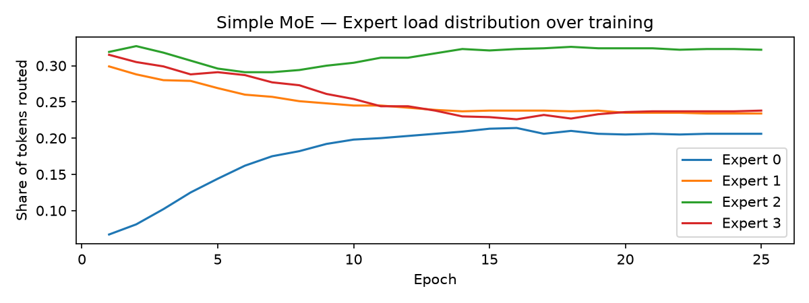
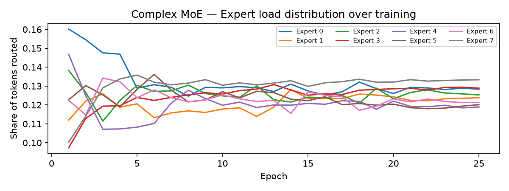

# Investigating Expert Collapse in EveNet Moe

---

# Overview

- Simple dataset (MNIST)
- Baseline (non-MoE) transformer model
- Simple MoE implementation
- Isolated EveNet MoE implementation

---

# Baseline Transformer (ViT)

- Single-layer Vision Transformer on 28×28 images, patched to 14×14
- CLS token + learnable positional embeddings
- Self-attention → LayerNorm → **standard FFN MLP** → LayerNorm → linear classifier
- FFN: two Linear layers (hidden dim 128, ReLU) - every token passes through the same network

---

# MoE Recap

- Core idea: dynamically routes inputs to specialized subnetworks ("experts")
- Each expert is a subnetwork (the number of experts is a hyperparameter)
  - In a transformer architecture they replace the feedforward layer
- Purpose is to allow specialization on different input features
- A gating network determines which experts to activate for each input
- Only a subset of the experts are activated for each input (hyperparameter)
- Typically implemented as a classifier

---

# Simple MoE Transformer

- Same backbone - FFN replaced with a **4-expert Mixture-of-Experts** layer
- Each expert: hidden dim 32 (total capacity matches baseline FFN)
- Top-2 hard: linear gate scores tokens, dispatches to 2 highest-scoring experts
- Tokens processed independently by their selected experts, recombined with softmax weights
- Single load-balancing loss term (coefficient 0.05) to encourage even utilisation

---

# EveNet MoE

- 8 routed experts + 0 shared experts - twice the specialisation of simple MoE
- Each expert: hidden dim 64, GELU activation (matches EveNet)
- Top-2 routing with stochastic noise: extra learned noise head keeps exploration alive during training
- Two balancing terms: auxiliary loss (α = 0.01) + logit-magnitude regularisation (c_z = 0.001)

---

# Training Setup

| Hyperparameter | Value                             |
| -------------- | --------------------------------- |
| Dataset        | MNIST (60K train / 10K test)      |
| Embedding dim  | 64                                |
| Epochs         | 25                                |
| Batch size     | 64                                |
| Optimizer      | Adam, LR 0.001 + cosine annealing |
| Device         | CUDA                              |

Both MoE variants trained from scratch, independently of each other and the baseline.

---

# Performance Comparison

| Metric            | Baseline | Simple MoE        | EveNet MoE            |
| ----------------- | -------- | ----------------- | --------------------- |
| **Test Accuracy** | 96.52 %  | 92.91 % (−3.6 pp) | **96.61 % (+0.1 pp)** |
| Test Loss         | 0.124    | 0.247 (2×)        | 0.150 (1.2×)          |
| Final Train Loss  | 0.347    | -                 | 0.024                 |

- Simple MoE underperforms badly - EveNet MoE **matches baseline accuracy** despite only activating 2 of 8 experts per token

---

# Expert Routing Distribution (Final Epoch) - Simple MoE

| Expert | Share      | Deviation   |
| ------ | ---------- | ----------- |
| E0     | 20.6 %     | −4.4 pp     |
| E1     | 23.8 %     | −1.2 pp     |
| **E2** | **32.2 %** | **+7.2 pp** |
| E3     | 23.8 %     | −1.2 pp     |

---

# Expert Routing Distribution (Final Epoch) - EveNet MoE

| Expert | Share       | Deviation   |
| ------ | ----------- | ----------- |
| E0     | 12.4 %      | −0.1 pp     |
| E1–E6  | 12.5–12.7 % | ≤ +0.2 pp   |
| **E7** | **11.8 %**  | **−0.7 pp** |

---

# Simple MoE - Routing Evolution

- Expert 2 absorbs ~32 %

---

# EveNet MoE - Routing Evolution

- Nearly uniform from epoch 4 onward - all experts within ±1.5 pp of fair share

---

# Key Takeaways

- **Simple MoE shows mild expert collapse:** E0 never recovers from a cold start (6.7 % → 20.6 %), E2 dominates
- **EveNet MoE achieves near-uniform routing** within 4 epochs and maintains it - max deviation only −0.7 pp
- The combination of **stochastic noise + dual balancing losses** is what makes the difference
